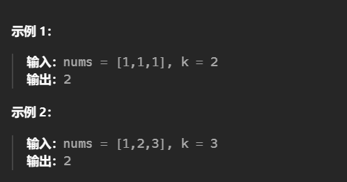

1.前缀和
当前缀和-目标值存在于前缀和数组中时，说明遍历过和为目标值的数组，得到结果+1。   

给你一个整数数组 nums 和一个整数 k ，请你统计并返回 该数组中和为 k 的子数组的个数 。
子数组是数组中元素的连续非空序列。

```c++
class Solution {
public:
    int subarraySum(vector<int>& nums, int k) {
        unordered_map<int, int> count;
        count[0] = 1; // 初始化前缀和为0的个数为1，这样可以处理从头开始的子数组
        int pre_sum = 0; // 用于记录前缀和
        int result = 0; // 统计和为 k 的子数组个数

        for (int num : nums) {
            pre_sum += num; // 更新前缀和
            // 检查是否存在前缀和为 pre_sum - k
            if (count.find(pre_sum - k) != count.end()) {
                result += count[pre_sum - k]; // 增加符合条件的子数组个数
            }
            count[pre_sum]++; // 更新当前前缀和的计数
        }

        return result; // 返回最终的结果
    }
};
```
2.给你一个整数数组 nums ，请你找出一个具有最大和的连续子数组（子数组最少包含一个元素），返回其最大和。
子数组
是数组中的一个连续部分。
```c++
int pre = 0, maxAns = nums[0];
        for (const auto &x: nums) {
            pre = max(pre + x, x);
            maxAns = max(maxAns, pre);
        } 
        return maxAns;
```