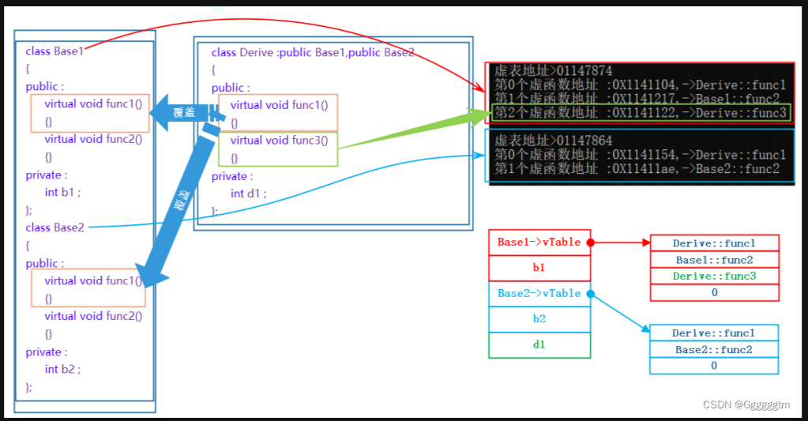
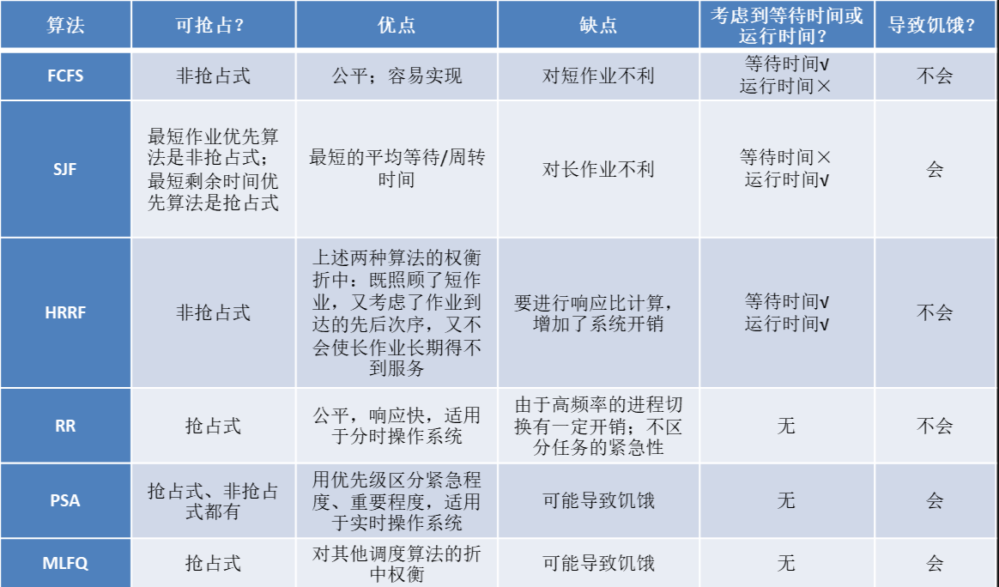
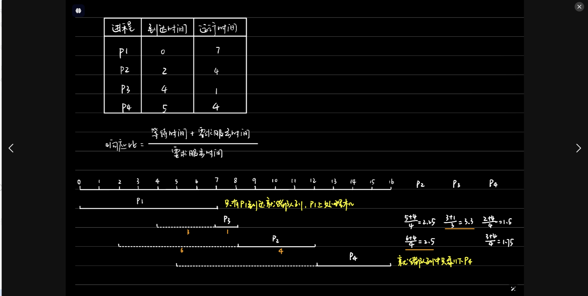
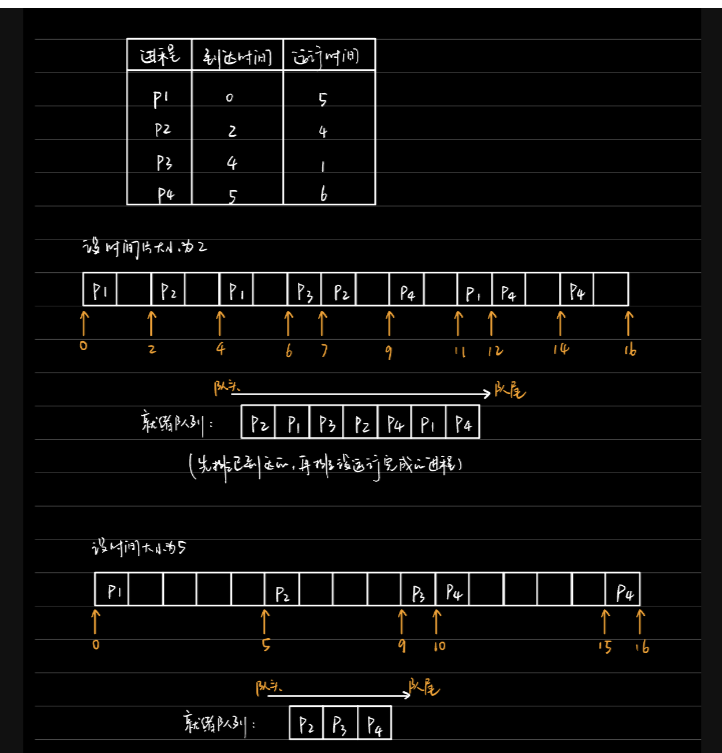
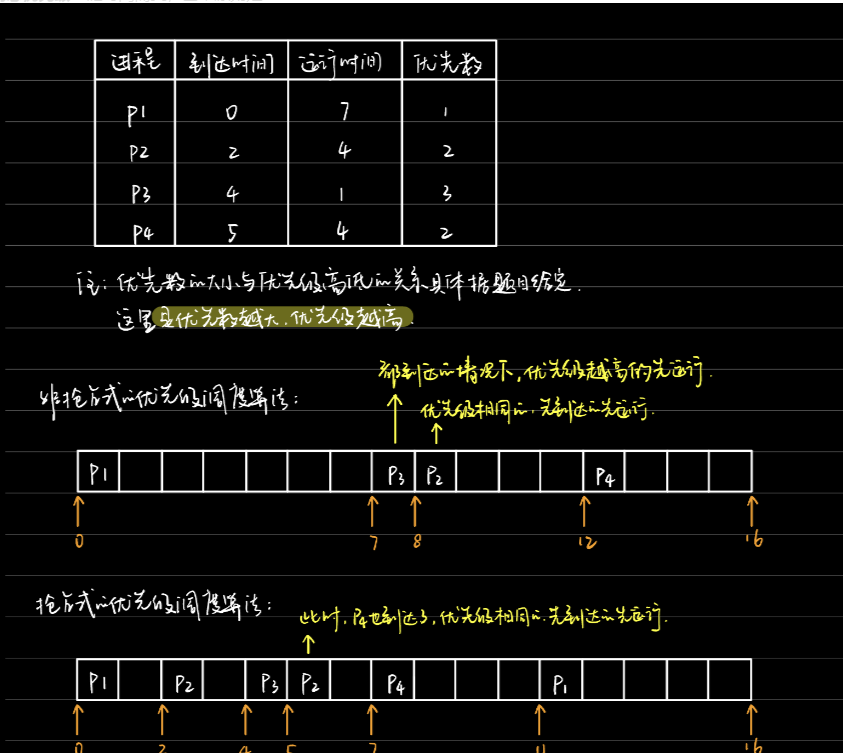
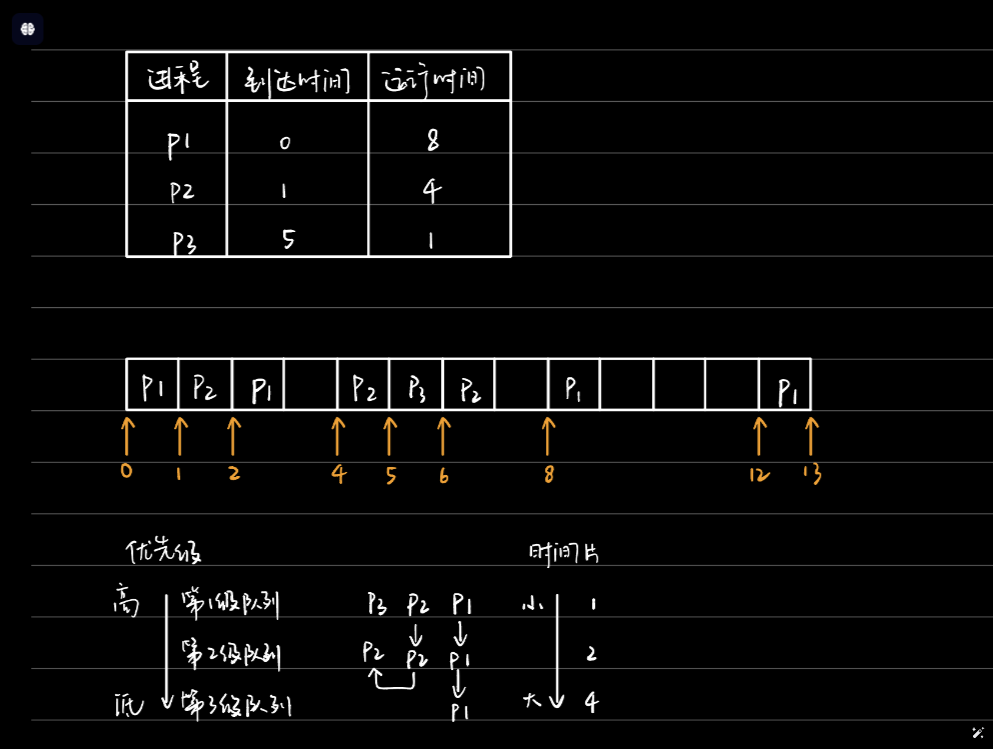

1.客户端向服务器发一段int要怎么发？可能会出现哪些字符串不会出现的错误？
客户端可以将int数据转换为字节数组，然后通过网络协议（如TCP/IP）将字节数组发送到服务器
可能会出现哪些字符串不会出现的错误？
当字符串处理不当时，常见的错误包括：
空指针异常（NullPointerException）：尝试在空字符串上调用方法。
字符串索引越界：访问字符超出字符串长度。
编码错误：处理不同字符编码时可能会引起字符丢失或乱码。

2.服务器端收到一段int要怎么处理？
服务器端收到一段int后，需要将其转换为字符串，并将其发送给客户端。
服务器端处理int到字符串的过程：
- 将int转换为字符串。
  ```c++
  std::string str = std::to_string(num);
  ```
- 将字符串发送给客户端。
  ```c++
  send(sockfd, str.c_str(), str.length(), 0);
  ```
  3.电脑有8个G的物理内存，a进程占了四个g，b进程占了4个g，现在还能跑起来其它的进程吗
  在这种情况下，虽然物理内存已被完全占用，但可以通过虚拟内存允许其他进程运行。操作系统会将一些不常用的内存页面交换到磁盘，从而释放物理内存供新进程使用。

  4.为什么虚拟内存比物理内存更大？
  虚拟内存的设计使得操作系统能够为每个进程分配的内存空间不仅限于物理内存的大小。通过使用磁盘空间（如交换文件或分页文件）来扩展虚拟内存的大小，可以让操作系统运行更多的进程。

  5.虚拟内存的实现方式有哪些？
  虚拟内存的实现方式有两种：
  - 基于页面的虚拟内存：将进程的虚拟地址空间划分为大小相等的页面，并将这些页面映射到物理内存上。当进程访问一个页面时，操作系统会自动将其映射到物理内存上。
  - 基于段的虚拟内存：将进程的虚拟地址空间划分为大小不等的段，并将这些段映射到物理内存上。当进程访问一个段时，操作系统会自动将其映射到物理内存上。

  6.a进程有没有可能把b进程的东西写坏？
    在正常情况下，进程间是隔离的，a进程不能直接写入b进程的内存。操作系统为每个进程提供了独立的虚拟地址空间，防止相互干扰。

  a进程有可能把b进程的东西写坏，原因如下：
  - 虚拟地址空间：a进程和b进程都有各自的虚拟地址空间，它们之间的数据是不共享的。
  - 内存映射：a进程和b进程都可以将自己的数据映射到内存中，但映射到同一块物理内存上。
  - 写时复制：当a进程修改了某个页面的内容时，操作系统会将该页面复制一份，并映射到新的物理内存上，然后才释放原来的物理内存。如果b进程也访问了该页面，它也会看到修改后的内容。
  - 内存保护：操作系统会设置内存访问权限，使得不同进程不能访问对方的内存空间。
  - 内存碎片：当进程的虚拟地址空间不连续时，操作系统会产生内存碎片，导致内存利用率低下。

  7.什么是页表？
  页表（Page Table）是一种数据结构，它将虚拟地址映射到物理地址。页表中包含了页表项（Page Table Entry，PTE），每一个PTE包含了虚拟地址的页号、页内偏移、物理页帧号、访问权限等信息。当CPU访问虚拟地址时，它会先通过页表找到对应的PTE，然后根据PTE中的物理页帧号找到对应的物理地址，并访问物理内存。

  8.页表的作用是什么？
  页表的作用是将虚拟地址映射到物理地址，以便CPU可以访问物理内存。页表的作用主要有以下几点：
    - 内存保护：页表可以设置内存访问权限，使得不同进程不能访问对方的内存空间。
  - 内存映射：页表可以将进程的虚拟地址映射到物理内存上，使得进程可以访问自己的数据。
  - 内存碎片：页表可以减少内存碎片，提高内存利用率。
  - 写时复制：页表可以实现写时复制，当进程修改某个页面的内容时，操作系统会将该页面复制一份，并映射到新的物理内存上，然后才释放原来的物理内存。如果其他进程也访问了该页面，它也会看到修改后的内容。
  
  9.介绍一下互斥锁、自旋锁和原子变量。
  互斥锁：用于保护临界区的同步机制，确保同一时刻只有一个线程能够访问共享资源。当一个线程获得互斥锁时，其他线程必须等待。
自旋锁：是一种忙等待的锁实现，线程在获取锁时会循环检测锁的状态，适合于持锁时间短的场景，避免了上下文切换的开销，但会消耗CPU资源。
原子变量：是一种能够在不需要锁的情况下实现线程安全的变量操作

10.布隆过滤器是什么？
布隆过滤器是一种空间效率高的概率性数据结构，用于测试某个元素是否在集合中。它允许误判（即可能判断为在集合中但实际不在），但不允许漏判。适用于需要快速查询大数据集的场景。时间复杂度O（N），比哈希表快很多。

11.总结一下派生类的虚表生成：a.先将基类中的虚表内容拷贝一份到派生类虚表中 b.如果派生类重写了基类中某个虚函数，用派生类自己的虚函数覆盖虚表中基类的虚函数 c.派生类自己新增加的虚函数按其在派生类中的声明次序增加到派生类虚表的最后。

 其实我们也不难发现，在多继承中对象 d 中，是有两个虚函数表的。观察上图可以看出：多继承派生类的未重写的虚函数放在第一个继承基类部分的虚函数表中

细心的同学可能已经发现，上述多继承的虚函数表中的重写后的同一个函数的地址竟然不同

虚表是一个指向虚函数的指针数组，它被存储在对象的内存布局的开头或结尾的某个位置。通常情况下，虚表位于对象内存布局的最前面，以便可以通过对象指针直接访问虚表。虚表对于每个类只有一个实例，并且所有该类的对象共享同一个虚表。这是因为虚表包含的是对于特定类的虚函数的地址，而不是具体对象的成员函数

12.在定义函数接口时，如何设计参数类型以提高传递效率？

可以使用引用来传递参数，这样不会拷贝对象，节省内存和时间。如果传递的是临时对象，可以使用右值引用（&&）和std::move来避免拷贝。

13.HTTPS 的安全保障过程
在建立 HTTPS 连接时，会经历以下几个重要步骤：

客户端请求：客户端（如浏览器）向服务器请求一个 HTTPS 连接。
服务器响应：服务器会将自己的 SSL/TLS 证书发送给客户端。
验证证书：客户端验证服务器发送的证书。如果通过验证，客户端会生成一个对称密钥，并用服务器的公钥加密后发送给服务器。
建立安全连接：服务器接收密钥后解密，双方使用对称密钥进行加密通信。
数据传输：数据在此后的传输过程中都经过加密，确保安全性

14.TCP/IP 协议族的五层模型
TCP/IP 协议的工作过程
在 TCP/IP 协议中，数据传输过程一般包括以下步骤：

数据封装：
应用层创建数据，并将其传输到传输层，封装成对应的 TCP 或 UDP 数据包。
传输层将数据包向下传递到网络层，添加 IP 头部信息。
网络层进一步向下传递到链路层，添加 MAC 地址和帧信息。

数据传输：
数据通过物理媒介（如光纤、无线电波）被传输到目标主机的网络接口。

数据解封装：
目标主机的链路层接收数据帧，去除链路层头部，向网络层传递。
网络层去除 IP 头部，向传输层传递。
传输层根据协议（TCP/UDP）处理数据，最终交给应用层。


13.操作系统调度算法


HRRF,响应比最高优先调度算法



比起早期的批处理操作系统来说，由于计算机造价大幅降低，因此之后出现的交互式操作系统（包括分时操作系统和实时操作系统）更注重系统的响应时间、公平性、平衡性等指标。而这几种算法恰好也能较好地满足交互式系统的需求。因此下面这三种算法适用于交互式系统。

RR:时间片轮换调度算法


PSA:优先级调度算法


MLFQ:多级反馈队列调度算法
算法规则：
1、建立多级就绪进程队列，各级队列优先级从高到低，时间片从小到大。每个队列赋予不同优先级，较高优先级队列一般分配给较短的时间片。
2、新进程到达时先进入第1级队列，按先来先服务原则排队等待被分配时间片，若用完时间片进程还未结束，则进程进入下一级队列队尾；若此时已经在最下级的队列，则重新放回该队列队尾。
3、处理器调度每次先从高优先级就绪队列中选取可占有处理器的进程，只有在选不到时，才从较低优先级就绪队列中选取进程。即只有第k级队列为空时，才会为k+1级队头的进程分配时间片。
4、当进程时间片用完时，由调度程序自动将其放回原队列队尾，并重新分配时间片。
5、当进程完成或发生阻塞时，由调度程序自动将其放回原队列队尾，并重新调度。
6、当时间片用完时，调度程序自动切换到下一进程，并重新分配时间片。
