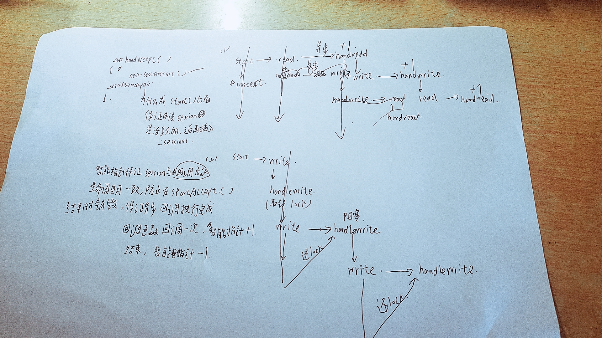
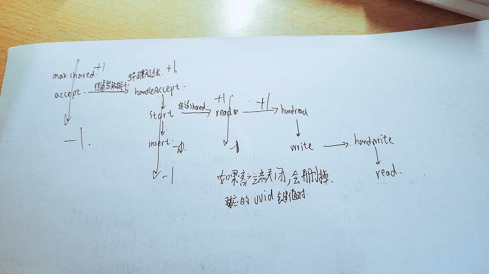

# 利用伪闭包延长连接的生命周期
使用lambda表达式机制来延长连接的生命周期
# # 如果构造伪闭包
思路： 1   利用智能指针被复制或使用引用计数加一的原理保证内存不被回收 
2   bind操作可以将值绑定在一个函数对象上生成新的函数对象，如果将智能指针作为参数绑定给函数对象，
那么智能指针就以值的方式被新函数对象使用，那么智能指针的生命周期将和新生成的函数对象一致，从而达到延长生命的效果。 
# # 代码实现
```c++
void CServer::StartAccept() {
    shared_ptr<CSession> new_session = make_shared<CSession>(_ioc, this);//后面的智能指针保证startAccept结束new_session不被销毁,
    //new_session生命周期与异步回调函数一致,保证异步回调执行完成
    _acceptor.async_accept(new_session->Socket(), std::bind(&CServer::HandleAccept, this, new_session, placeholders::_1));
}

void CServer::HandleAccept(shared_ptr<CSession> new_session, const boost::system::error_code& error) {
    if (!error) {
        new_session->start();
        _sessions.insert(make_pair(new_session->Getuuid(), new_session));
    }
    else {
        cout << "session accept failed, error is " << error.what() << endl;
    }

    StartAccept();
}
```
# # 注意事项
为什么insert在start（）后面。是为了保证session是活跃的，然后再插入到map中。
bind绑定之后，调用回调函数，在回调函数中，将new_session的智能指针引用计数加一,保证new_session生命周期延长
保证startAccept结束new_session不被销毁,new_session生命周期与异步回调函数一致,保证异步回调执行完成
```c++
void CSession::start() {
	memset(_data, 0, max_length);
	_socket.async_read_some(boost::asio::buffer(_data, max_length),
    std::bind(&CSession::handread,this,placeholders::_1,
		placeholders::_2,shared_from_this()));
```
//在异步读操作中，将智能指针作为参数绑定(使用shared_from_this())给回调函数，保证new_session生命周期延长
# # handread和handwrite里面，如果客户端关闭连接，则需要清理session，使用clearSession函数删除对应的uuid的session。
```c++
void CSession::handwrite(const boost::system::error_code err,  shared_ptr<CSession> _self_shared)
{
	if (!err) {
		memset(_data, 0, max_length);
		_socket.async_read_some(boost::asio::buffer(_data, max_length), std::bind(&CSession::handread, this, std::placeholders::_1,
			std::placeholders::_2,_self_shared)
		);
	}
	else
	{
		cout << "write error" << endl;
		_server->ClearSession(_uuid);
	}
}
```
整体的流程是

