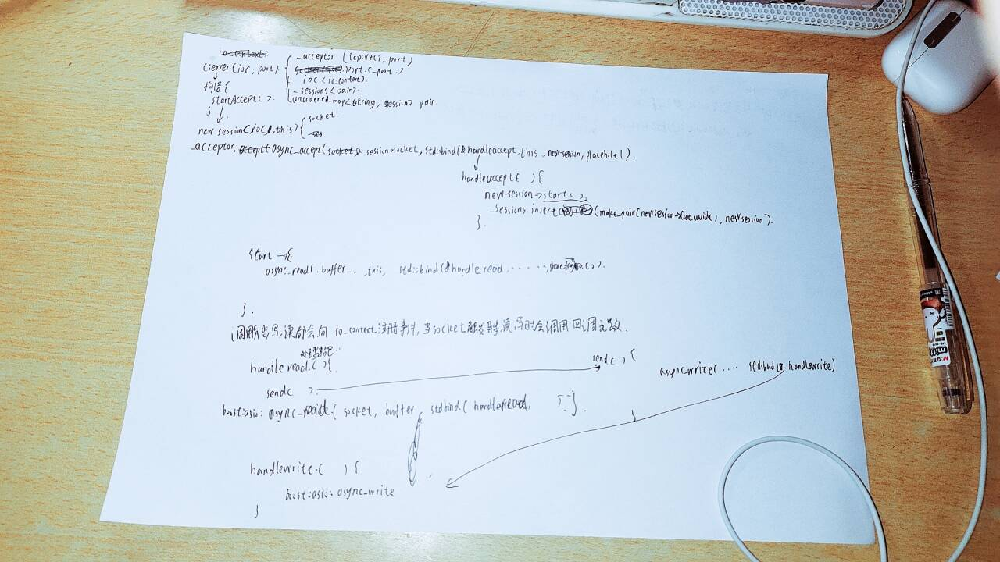
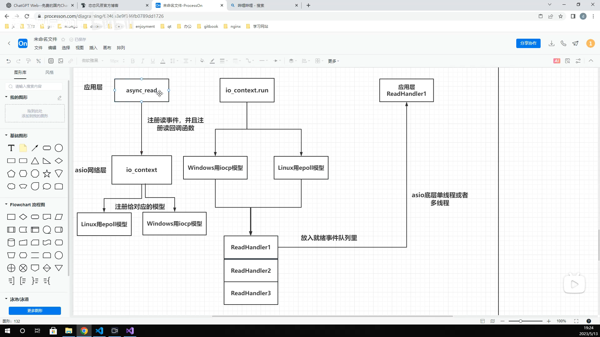
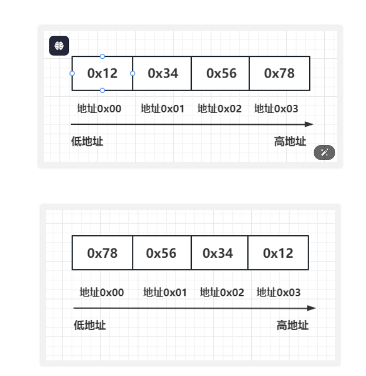

# 当前的服务器架构


# ioc_context逻辑架构

iocp/epoll模型轮询socket,检查是否有socket触发事件,有则处理事件,没有则继续轮询。
例如有读事件触发（客户端发送信息），就会把对应注册的读回调函数（readleHandler）放到就绪队列里面，按队列的顺序调用应用层回调函数。

protubuf无法处理粘包问题，所以需要自己实现协议解析。

# 字节序 小端模式和大端模式
 
小端模式：低地址存放低位字节，高地址存放高位字节。
大端模式：高地址存放低位字节，低地址存放高位字节。
输入：12345678
78是低位字节，12是高位字节。
小端模式：78 56 34 12
大端模式：12 34 56 78

## 代码示例
```c++
#include <iostream>

using namespace std;

// 判断当前系统的字节序是大端序还是小端序
bool is_big_endian() {
    int num = 1;
    if (*(char*)&num == 1) {
        // 当前系统为小端序
        return false;
    } else {
        // 当前系统为大端序
        return true;
    }
}

int main() {
    int num = 0x12345678;
    char* p = (char*)&num;

    cout << "原始数据：" << hex << num << endl;

    if (is_big_endian()) {
        cout << "当前系统为大端序" << endl;
        cout << "字节序为：";
        for (int i = 0; i < sizeof(num); i++) {
            cout << hex << (int)*(p + i) << " ";
        }
        cout << endl;
    } else {
        cout << "当前系统为小端序" << endl;
        cout << "字节序为：";
        for (int i = sizeof(num) - 1; i >= 0; i--) {
            cout << hex << (int)*(p + i) << " ";
        }
        cout << endl;
    }

    return 0;
}
```
为保证字节序一致性，网络传输使用网络字节序，也就是大端模式。 
在 boost::asio 库中，可以使用 
boost::asio::detail::socket_ops::host_to_network_long() 
和 boost::asio::detail::socket_ops::host_to_network_short() 函数将主机字节序转换为网络字节序
```c++
#include <boost/asio.hpp>
#include <iostream>

int main()
{
    uint32_t host_long_value = 0x12345678;
    uint16_t host_short_value = 0x5678;

    uint32_t network_long_value = boost::asio::detail::socket_ops::host_to_network_long(host_long_value);
    uint16_t network_short_value = boost::asio::detail::socket_ops::host_to_network_short(host_short_value);

    std::cout << "Host long value: 0x" << std::hex << host_long_value << std::endl;
    std::cout << "Network long value: 0x" << std::hex << network_long_value << std::endl;
    std::cout << "Host short value: 0x" << std::hex << host_short_value << std::endl;
    std::cout << "Network short value: 0x" << std::hex << network_short_value << std::endl;

    return 0;
}
```
上述代码中，使用了 boost::asio::detail::socket_ops::host_to_network_long() 和 boost::asio::detail::socket_ops::host_to_network_short() 函数将主机字节序转换为网络字节序。
host_to_network_long() 函数将一个 32 位无符号整数从主机字节序转换为网络字节序，返回转换后的结果。
host_to_network_short() 函数将一个 16 位无符号整数从主机字节序转换为网络字节序，返回转换后的结果

# 消息队列控制
发送时我们会将发送的消息放入队列里以保证发送的时序性，每个session都有一个发送队列，
因为有的时候发送的频率过高会导致队列增大，所以要对队列的大小做限制，当队列大于指定数量的长度时，就丢弃要发送的数据包，以保证消息的快速收发。
```c++
void CSession::Send(char* msg, int max_length) {
    std::lock_guard<std::mutex> lock(_send_lock);
    int send_que_size = _send_que.size();
    if (send_que_size > MAX_SENDQUE) {
        cout << "session: " << _uuid << " send que fulled, size is " << MAX_SENDQUE << endl;
        return;
    }

    _send_que.push(make_shared<MsgNode>(msg, max_length));
    if (send_que_size>0) {
        return;
    }
    auto& msgnode = _send_que.front();
    boost::asio::async_write(_socket, boost::asio::buffer(msgnode->_data, msgnode->_total_len), 
        std::bind(&CSession::HandleWrite, this, std::placeholders::_1, SharedSelf()));
}
```