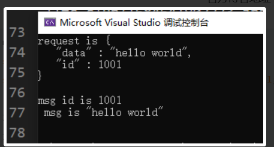

# json
jsoncpp 是一个 C++ JSON 库，它提供了将 JSON 数据解析为 C++ 对象、将 C++ 对象序列化为 JSON 数据的功能。它支持所有主流操作系统（包括 Windows、Linux、Mac OS X 等），并且可以与常见编译器（包括 Visual Studio、GCC 等）兼容。

jsoncpp 库是以源代码的形式发布的，因此使用者需要自己构建和链接库文件。该库文件不依赖于第三方库，只需包含头文件即可使用。

jsoncpp 库的特点包括：

轻量级：JSON 解析器和序列化器都非常快速，不会占用太多的 CPU 和内存资源；

易于使用：提供简单的 API，易于理解和使用；

可靠性高：经过广泛测试，已被许多企业和开发者用于生产环境中；

开源免费：遵循 MIT 许可证发布，使用和修改均免费。

总之，jsoncpp 是一款优秀的 C++ JSON 库，它可以帮助你轻松地处理 JSON 数据，为你的项目带来便利和高效。

 例子
 从这段代码中，我们先将root序列化为字符串，再将字符串反序列化为root2. 
 ```cpp
 #include <iostream>
#include <json/json.h>
#include <json/value.h>
#include <json/reader.h>

int main()
{
    Json::Value root;
    root["id"] = 1001;
    root["data"] = "hello world";
    std::string request = root.toStyledString();//序列化
    std::cout << "request is " << request << std::endl;

    Json::Value root2;
    Json::Reader reader;
    reader.parse(request, root2);//反序列化
    std::cout << "msg id is " << root2["id"] << " msg is " << root2["data"] << std::endl;
}
 ```
 输出如下
 

Json::Value 是jsoncpp库中的一个重要类，它用于表示JSON中的值，可以是对象、数组、字符串、数字、布尔值或者空值
 Json::Reader 是jsoncpp库中的一个类，用于解析（反序列化）JSON字符串并将其存储到 Json::Value 对象中


 在客户端发送数据时对发送的数据进行序列化
 ```cpp
    // SyncClient.cpp : 此文件包含 "main" 函数。程序执行将在此处开始并结束。
//

#include <iostream>
#include <boost/asio.hpp>
#include <thread>
#include "msg.pb.h"
#include <json/json.h>
#include <json/value.h>
#include <json/reader.h>

using namespace std;
using namespace boost::asio::ip;
const int MAX_LENGTH = 1024 * 2;
const int HEAD_LENGTH = 2;
int main()
{
	try {
		//创建上下文服务
		boost::asio::io_context   ioc;
		//构造endpoint
		tcp::endpoint  remote_ep(address::from_string("127.0.0.1"), 10086);
		tcp::socket  sock(ioc);
		boost::system::error_code   error = boost::asio::error::host_not_found; ;
		sock.connect(remote_ep, error);
		if (error) {
			cout << "connect failed, code is " << error.value() << " error msg is " << error.message();
			return 0;
		}

		Json::Value root;
		root["id"] = 1001;
		root["data"] = "hello world";
		std::string request = root.toStyledString();
		size_t request_length = request.length();
		char send_data[MAX_LENGTH] = { 0 };
		//转为网络字节序
		int request_host_length = boost::asio::detail::socket_ops::host_to_network_short(request_length);
		memcpy(send_data, &request_host_length, 2);
		memcpy(send_data + 2, request.c_str(), request_length);
		boost::asio::write(sock, boost::asio::buffer(send_data, request_length + 2));
		//MsgData msgdata;
		//msgdata.set_id(1001);
		//msgdata.set_data("hello world");
		//std::string request;
		//msgdata.SerializeToString(&request);
		//short request_length = request.length();
		//char send_data[MAX_LENGTH] = { 0 };
		////转为网络字节序
		//short request_host_length = boost::asio::detail::socket_ops::host_to_network_short(request_length);
		//memcpy(send_data, &request_host_length, 2);
		//memcpy(send_data + 2, request.c_str(), request_length);
		//boost::asio::write(sock, boost::asio::buffer(send_data, request_length + 2));
		cout << "begin to receive..." << endl;
		char reply_head[HEAD_LENGTH];//先读两个字节(头节点)
		size_t reply_length = boost::asio::read(sock, boost::asio::buffer(reply_head, HEAD_LENGTH));
		short msglen = 0;
		memcpy(&msglen, reply_head, HEAD_LENGTH);//读取数据长度
		//转为本地字节序
		msglen = boost::asio::detail::socket_ops::network_to_host_short(msglen);
		char msg[MAX_LENGTH] = { 0 };
		size_t  msg_length = boost::asio::read(sock, boost::asio::buffer(msg, msglen));
		MsgData recvdata;
		recvdata.ParseFromArray(msg, msglen);//显示接受到的信息，反序列化
		std::cout << "msg id is " << recvdata.id() << " msg is " << recvdata.data() << endl;
		getchar();
	}
	catch (std::exception& e) {
		std::cerr << "Exception: " << e.what() << endl;
	}
	return 0;
}


    ```
 在服务端接收数据时对接收的数据进行反序列化
 ```cpp
     Json::Reader reader;
    Json::Value root;
    reader.parse(std::string(_recv_msg_node->_data, _recv_msg_node->_total_len), root);
    std::cout << "recevie msg id  is " << root["id"].asInt() << " msg data is "
    << root["data"].asString() << endl;
    ```