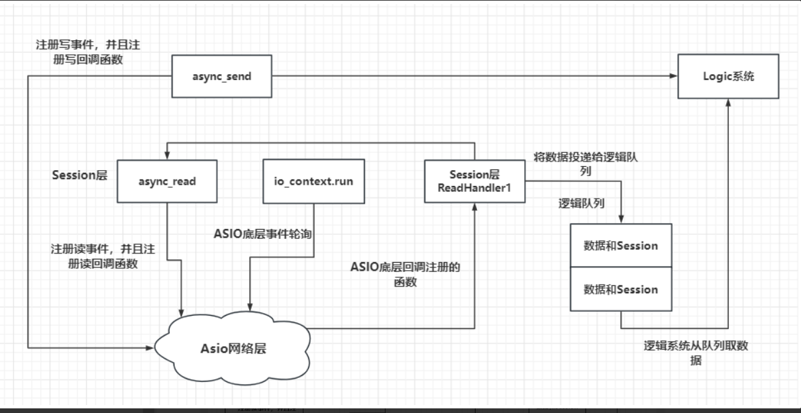

我们接下来要设计的服务器结构是这样的：


 设计一个单例类
 单例模式模板类将无参构造，拷贝构造，拷贝赋值都设定为protected属性，其他的类无法访问，其实也可以设置为私有属性。析构函数设置为公有的，其实设置为私有的更合理一点。 Singleton有一个static类型的属性_instance, 它是我们实际要开辟类型的智能指针类型。 s_flag是函数GetInstance内的局部静态变量，该变量在函数GetInstance第一次调用时被初始化。以后无论调用多少次GetInstance s_flag都不会被重复初始化，而且s_flag存在静态区，会随着进程结束而自动释放。 call_once只会调用一次，而且是线程安全的， 其内部的原理就是调用该函数时加锁，然后设置s_flag内部的标记，设置为已经初始化，执行lambda表达式逻辑初始化智能指针，然后解锁。第二次调用GetInstance 内部还会调用call_once, 只是call_once判断s_flag已经被初始化了就不执行初始化智能指针的操作了
 ```c++
#pragma once
#include<iostream>
#include<memory>
#include<mutex>
template<typename T>
class Singleton {
protected:
	Singleton()=default;
	Singleton(const Singleton<T>&) = delete;
	Singleton& operator=(const Singleton<T>& st) = delete;

	static std::shared_ptr<T> _instance;
public:
    static std::shared_ptr<T>  Getinstance() {
        static std::once_flag s_flag;
        std::call_once(s_flag, [&]() {
            _instance = shared_ptr<T>(new T);
            });
        return _instance;
    }

    void PrintAddress() {
        std::cout << _instance.get() << endl;
    }
    ~Singleton() {
        std::cout << "this is singleton destruct" << std::endl;
    }
};
template<typename T>
std::shared_ptr<T> Singleton<T>::_instance=nullptr;
```
